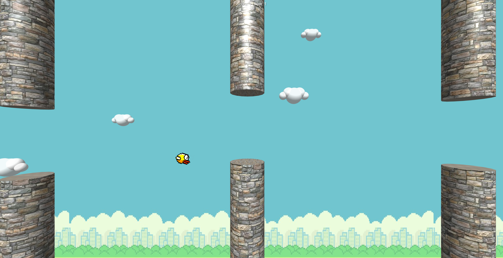

# 3D Flappy Bird 🐦

A modern 3D implementation of the classic Flappy Bird game using Three.js, featuring a dynamic leaderboard system and multiple difficulty levels.



## Features

- 🎮 3D gameplay with smooth animations
- 🏆 Real-time leaderboard system
- 🎯 Multiple difficulty levels (Easy/Hard)
- 🎵 Background music and sound effects
- 📱 Responsive design
- 🌟 Progressive difficulty (speed increases with score)

## Tech Stack

- **Frontend**: 
  - Three.js for 3D rendering
  - Vanilla JavaScript (ES6+)
  - HTML5 & CSS3

- **Backend**:
  - Supabase for database and authentication
  - Real-time leaderboard updates

## Architecture

The game follows a modular architecture:
- `game.js`: Core game logic and Three.js setup
- `supabase.js`: Database interactions and leaderboard management
- `config.js`: Environment and game configuration

## Quick Start

1. Clone the repository
2. Create a `.env` file with your Supabase credentials
3. Start a local server:
   ```bash
   python -m http.server 8000
   ```
4. Open http://localhost:8000

## Controls

- **Space** or **Click**: Make the bird flap
- **Easy Mode**: Wider gaps, slower pipes
- **Hard Mode**: Narrower gaps, faster pipes

## Development

Built with modern web technologies and best practices:
- ES6 Modules for code organization
- Environment-based configuration
- Responsive design principles
- Performance optimized 3D rendering

## License

MIT License - feel free to use this code for your own projects!

## Credits

- Game assets and sounds are custom created
- Built with Three.js and Supabase
- Inspired by the original Flappy Bird game 